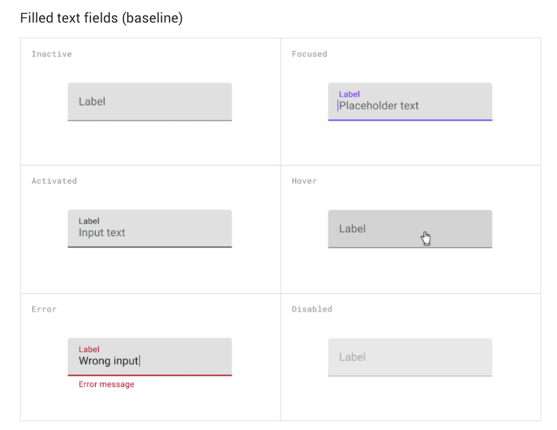
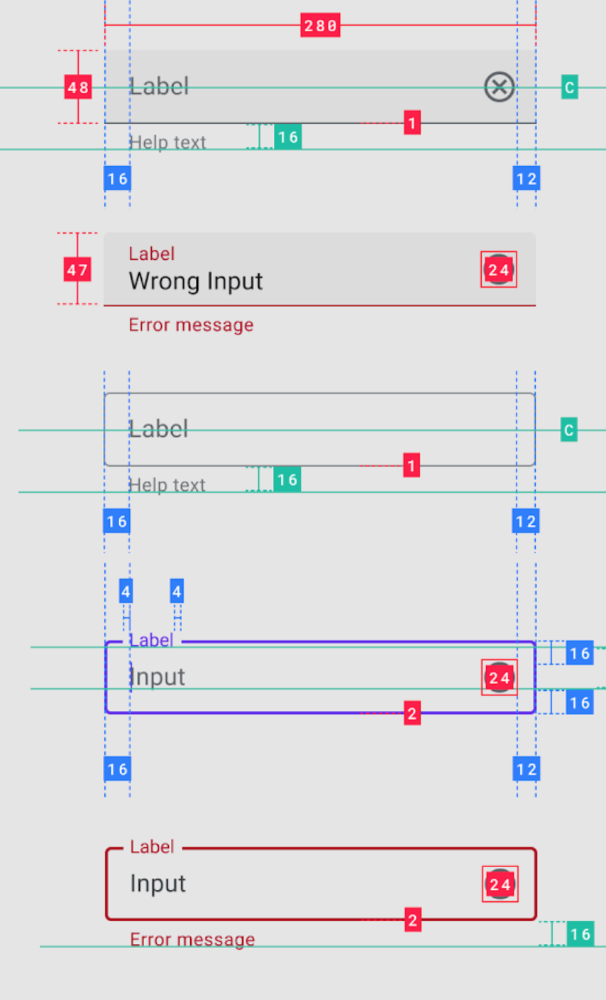
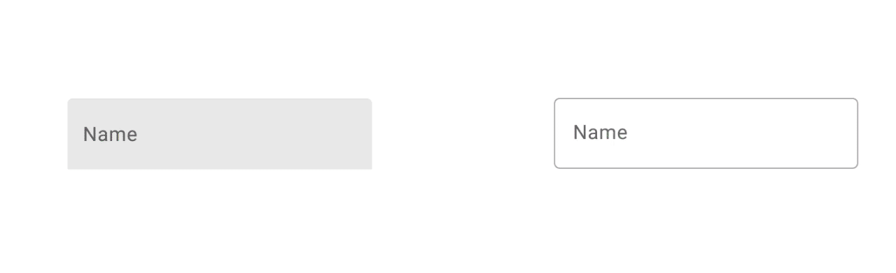
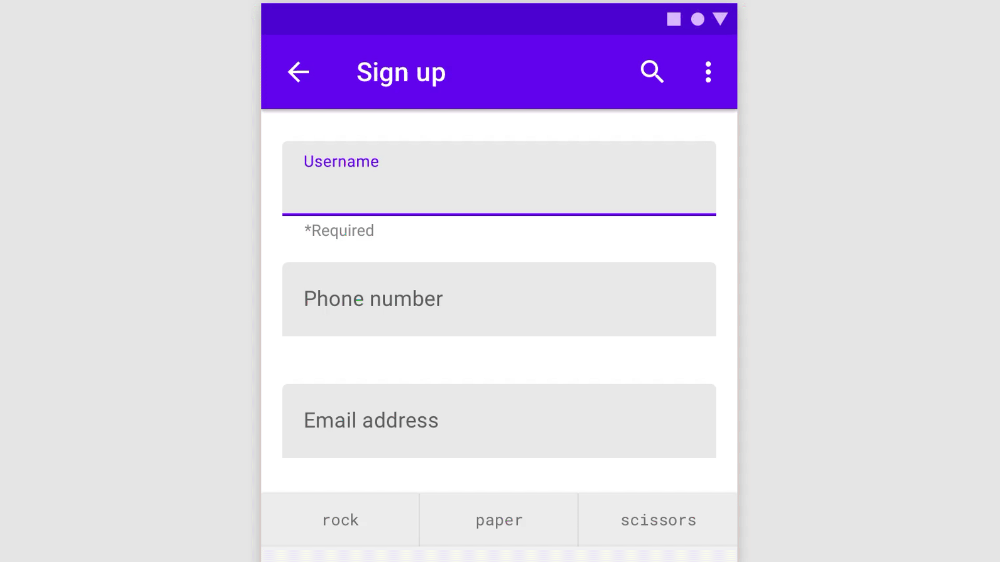

# Forms & Text Fields Class Task

Become familiar with [Material Design Text Fields Guidelines](https://material.io/components/text-fields) then create some form fields starting off by creating the smaller components and then grouping these together, use the guidance below for  size and space, **you can then create them in either Adobe XD or Figma.**

Set-up micro interactions using states in XD and variants in Figma (where appropriate). **You can create your own style components as long as they have consistent structure and offer the necessary user of feedback.**

### Here are the baseline states for form fields

### Use the guidance below to create your components on a 8 point grade.

### Once you have created your components add micro interactions

### Then follow on and lay them out on screens

